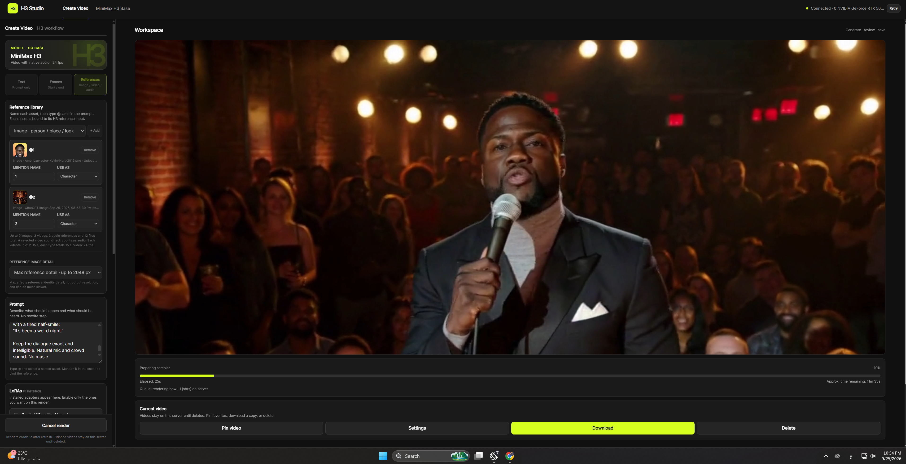
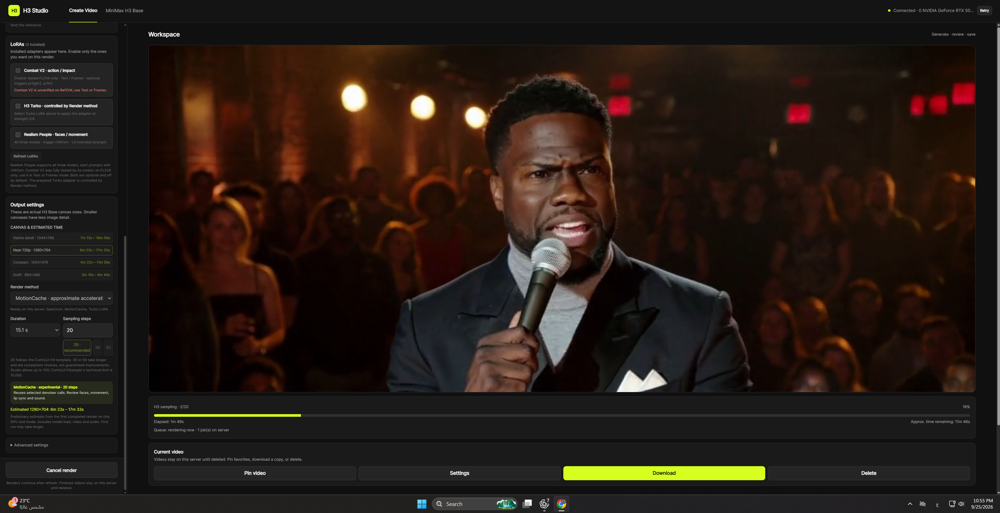

# H3 Higgsfield

An independent, creator-friendly interface for **MiniMax H3 video with native audio**. ComfyUI runs behind the page; creators work with scenes, references, settings, a queue, and a video library instead of a node canvas. This project is not affiliated with Higgsfield.



**[Watch the Spectrum demo](docs/demo/spectrum-no-lora.mp4)** · **[Watch the MotionCache demo](docs/demo/motioncache-no-lora.mp4)** · **[Install](#install-on-an-nvidia-linux-server)**

## See it in action

These are two separate 15-second reference-mode generations with native audio. Both used the 1280 × 704 canvas, 24 fps, 20 sampling steps, and **no LoRAs**. Their prompts differ, so they are examples of each method, **not** a controlled speed or quality comparison. The render method was confirmed from each original MP4's embedded ComfyUI graph.

| Spectrum | MotionCache |
| --- | --- |
| [](docs/demo/spectrum-no-lora.mp4) | [](docs/demo/motioncache-no-lora.mp4) |
| [Watch with audio](docs/demo/spectrum-no-lora.mp4) | [Watch with audio](docs/demo/motioncache-no-lora.mp4) |

The published MP4s retain their video and audio streams; private prompt metadata was removed.

<details>
<summary>See the MotionCache settings and live render progress</summary>



</details>

## What you get

| Mode | Input | H3 path |
| --- | --- | --- |
| Text | Scene prompt | FL2VA |
| Frames | Prompt + start and/or end image | FL2VA |
| References | Prompt + named images, videos, or audio (`@name`) | Ref2VA |

- A single English UI for prompts, output size, duration, steps, render method, and optional LoRAs.
- Video references at other frame rates are converted to **24 fps** on upload; their playback speed and available soundtrack are retained. H3's combined video-reference limit is 15 seconds.
- Original quality by default. Spectrum, MotionCache, and the FL2VA Turbo LoRA are prepared as separate, optional choices; they can change the result. Installed LoRAs appear as optional switches.
- Native video and audio come from the same H3 sample. Audio is checked after saving; listening remains the final check.
- Upload and render progress, a changing time estimate, a queue, thumbnails, saved settings for each clip, and a library that survives page refreshes.
- Input videos cannot be mistaken for completed outputs: the UI accepts a result only from the Save Video node after the file appears on the server.

## Install on an NVIDIA Linux server

Requires a working NVIDIA driver, Python 3, and room for roughly **63.4 GB of H3 weights** plus dependencies and outputs; 100 GB free is recommended for a first setup. An RTX 5090 with 32 GB VRAM is the tested configuration. An empty disk cannot be ready in seconds because the models must download.

```bash
git clone https://github.com/underworldhistory1-ctrl/h3-higgsfield.git
cd h3-higgsfield
bash install.sh
```

The installer finds an existing ComfyUI or installs the verified H3-capable revision, checks missing tools and Python packages, reuses or downloads verified model files, prepares the optional nodes and LoRAs, and opens **H3 Higgsfield** as the ComfyUI landing page. It checks the queue before restarting an existing server. If the provider's login or process manager blocks an automatic restart, it stops with a clear restart instruction rather than claiming the app is ready.

For a different ComfyUI location, use `bash install.sh --comfy-root /path/to/ComfyUI`. The default new installation binds to `127.0.0.1:8188`; reach it through an SSH tunnel or an authenticated cloud proxy. Only use `--bind 0.0.0.0` behind access control. Once ready, open `/extensions/h3_studio/index.html` at your server address. The server root also redirects to this page; the Comfy node editor is reserved for maintenance at `/?view=nodes`.

Model downloads can require accepting the [MiniMax H3 license](https://huggingface.co/MiniMaxAI/MiniMax-H3) or Hugging Face access. The model weights, private reference files, personal video library, and server passwords are **not** in this Git repository; only the two public demo clips above are included. Re-running the installer checks and reuses valid cached weights. For a portable handoff or optional video-library restore, see [the server guide](deploy/CLOUD_BOOTSTRAP_AR.md).

## What has been verified

On the project's RTX 5090 server, Original mode produced a short clip and a 15.1-second clip with decodable video and audio. A 25 fps clip with audio was accepted as a reference, converted to 24 fps, and cleaned up afterward. The interface's three modes map to their intended H3 nodes, and output files are checked before being shown as complete. The [compatibility map](docs/COMPATIBILITY_MATRIX_AR.md) and [workflow map](docs/GRAPH_MAP.md) record the boundaries.

This evidence does not guarantee every prompt, LoRA combination, speed method, or a new GPU image. A video reference guides **new generation**; it is not a pixel-locked one-object edit. Exact local editing needs a separate masked inpainting workflow, which this UI does not claim to provide.

Built on [ComfyUI](https://github.com/Comfy-Org/ComfyUI) and [MiniMax H3](https://huggingface.co/MiniMaxAI/MiniMax-H3). This repository's code is MIT-licensed; demo media, model weights, and third-party nodes have separate rights and licenses.
